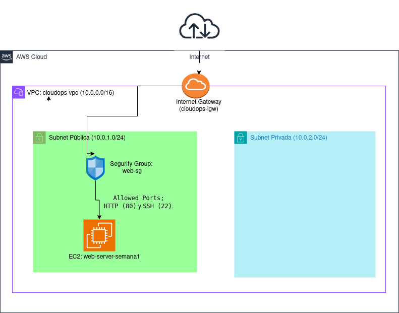
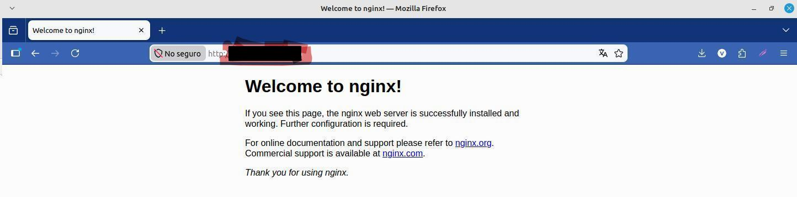

# 🌐 Semana 1: Diseño de Red Segura (VPC) y Servidor Web en AWS

## 🎯 Objetivo
Diseñar una infraestructura de red personalizada que cumpla con el principio de aislamiento, separando recursos públicos de privados, y automatizando el despliegue de un servidor web.

## 🏗️ Arquitectura

## 🏗️ Componentes de la Arquitectura
* **VPC (10.0.0.0/16):** Mi espacio privado en la nube de AWS.
* **Public Subnet (10.0.1.0/24):** Zona con acceso a internet para el servidor web.
* **Internet Gateway (IGW):** El puente que permite la comunicación bidireccional con el mundo exterior.
* **Security Group:** Configurado como firewall estatal permitiendo solo `Puerto 22 (SSH)` para administración y `Puerto 80 (HTTP)` para usuarios.

## 🚀 Tecnologías Utilizadas
* **AWS VPC:** Subredes, Internet Gateway, Tablas de Enrutamiento.
* **AWS EC2:** Instancia Ubuntu, Security Groups (Firewall).
* **Linux/Bash:** Scripting de User Data para automatización de Nginx.

## ⚙️ Pasos de Implementación
1. Creación de VPC con bloque CIDR `10.0.0.0/16`.
2. Configuración de subred pública y privada en diferentes Zonas de Disponibilidad.
3. Enrutamiento de tráfico hacia internet mediante un IGW.
4. Despliegue de EC2 (Ubuntu) con auto-asignación de IP pública.
5. Aplicación de reglas de Security Group (Inbound: SSH 22, HTTP 80).
6. Instalación automatizada de Nginx mediante script de User Data.

## 🚀 Automatización con User Data
En este laboratorio utilicé un script de Bash para evitar la configuración manual de la instancia. El script realiza:
1. Actualización de repositorios.
2. Instalación de Nginx.
3. Personalización del index HTML.

## 🚀 Resultado Final Accesando al Servidor Web

## 💡 Lecciones Aprendidas
* Por qué una subred no es pública hasta que su tabla de rutas apunta a un Internet Gateway.
* La importancia del principio de menor privilegio en los Security Groups.

> **Logro:** He logrado que la infraestructura sea "desechable" y reproducible. Si borro la EC2 y lanzo otra con el mismo script, el servicio vuelve a estar arriba en segundos.
